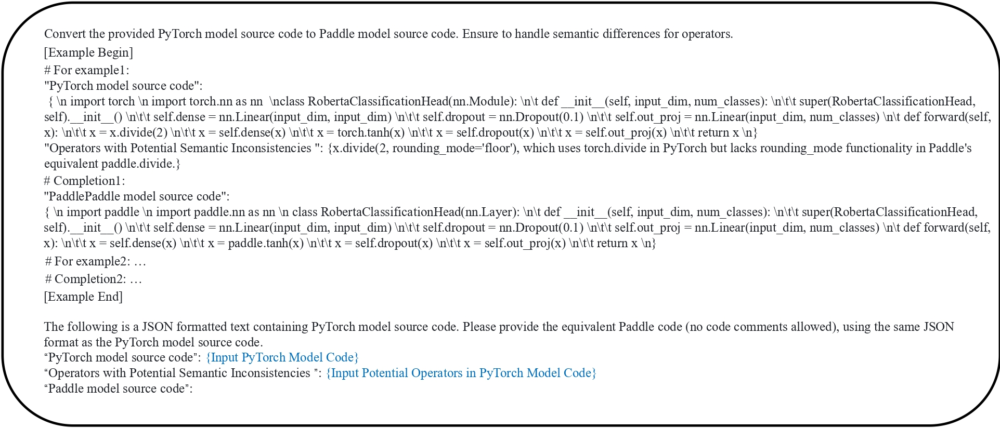
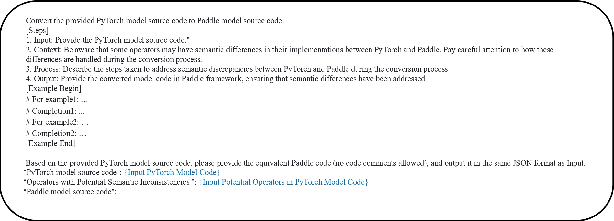

# Prompt Template

This experiment designs two prompt templates to test three LLMs: gpt-3.5-turbo-0125, gpt-4o-2024-05-13, and deepseek-coder-V2-0724, using OpenAI and DeepSeek APIs. The aim is to evaluate the effectiveness of each LLM in handling framework conversions that require careful consideration of semantic differences between operators in **PyTorch** and **PaddlPaddle**.

## Orginal Prompting

### Template Structure

1. **Introduction**
   - The template starts with a brief directive explaining the task: converting PyTorch model source code to PaddlePaddle model source code and emphasizing the importance of handling semantic differences for operators.

2. **Example Begin**
   - This section indicates the beginning of an example conversion to illustrate the template's usage.

3. **PyTorch Model Source Code**
   - Presents the PyTorch model code snippet, specifically a class definition for `RobertaClassificationHead`. This class inherits from `nn.Module` and includes methods for initialization and forward propagation.

4. **Operators with Potential Semantic Inconsistencies**
   - Lists specific operators that may encounter semantic inconsistencies during the conversion process. For instance, it mentions `x.divide(2, rounding_mode='floor')`, highlighting that while `torch.divide` supports a `rounding_mode` parameter, its equivalent in Paddle (`paddle.divide`) does not.

5. **PaddlePaddle Model Source Code**
   - Provides the converted PaddlePaddle model code corresponding to the PyTorch example. The class definition is adjusted to inherit from `nn.Layer`, a PaddlePaddle specific class, with appropriate modifications to the methods to match PaddlePaddle's syntax and functionalities.

6. **Example End**
   - Marks the conclusion of the example within the template.

### Usage Context

- The template is used in a JSON formatted text which contains placeholders for the PyTorch model source code and lists the operators that might have potential semantic inconsistencies. Users are expected to fill these placeholders with the relevant PyTorch model code and detail the operators before providing the equivalent Paddle code.

## CoT Prompting

### Template Structure

1. **Steps**
   - The template is broken down into a four-step guide to streamline the conversion process:

     - **Input:** Start by providing the source PyTorch model code. This sets the stage for the conversion task.
     - **Context:** Emphasizes the importance of being aware of operators that may differ semantically between PyTorch and PaddlePaddle, setting expectations for careful attention during conversion.
     - **Process:** Instructs to describe the steps taken to address semantic discrepancies. This step is crucial for ensuring that the conversion not only translates the code but also adapts its functionality to the new framework.
     - **Output:** Calls for providing the converted Paddle model code in the same JSON format as the input, ensuring that the semantic differences have been fully addressed.

2. **Example Section**
   - The template includes an 'Example Begin' and 'Example End' section to delineate a sample conversion process. This section helps illustrate how the steps can be applied to a real-world example.

3. **JSON Formatted Input and Output**
   - Both the input PyTorch code and the output Paddle code are to be provided in JSON format. This structured format helps in maintaining clarity and consistency in how the code is presented and reviewed.

### Usage Context

- The CoT Prompt Template is designed to not only facilitate code conversion but also educate the user on the nuanced differences between the frameworks. By breaking down the process into detailed steps, it encourages a more thoughtful and thorough approach to code translation, ensuring higher quality and functional integrity in the converted code.
